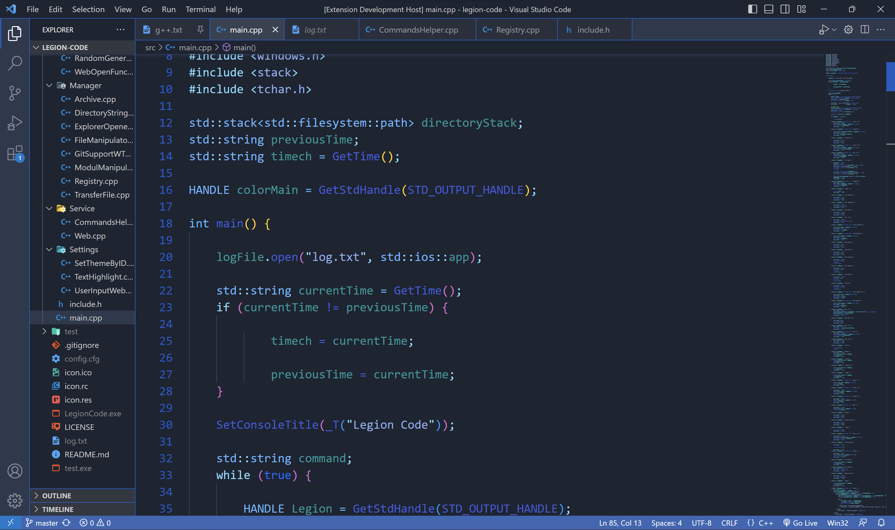

# Powdery Shadows

Powdery Shadows is a VS Code theme extension that costumize the editor like a real shadow.

# Menu

# Colors

The current version contain only a based theme, the classic one.
Main colors: 

- Blue
- White
- Dark blue
- Light blue
- Yellow